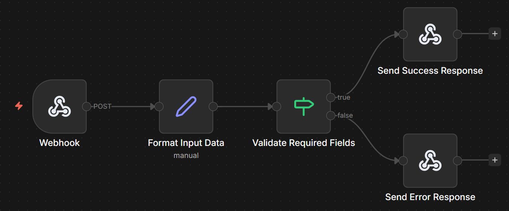

# n8n Day 1–2: Core Automation Workflows

## 📌 Overview

This repository contains the implementation of Day 1–2 tasks for the AI Automation Internship.

The goal of these tasks is to demonstrate:

* Webhook-based automation
* Input validation logic
* External API integration
* Structured and efficient workflow design in n8n

---

## ⚙️ Workflows Included

### 1. Webhook to Response Workflow

#### 🔹 Description

This workflow receives user input via webhook, validates required fields, and returns a structured response.

#### 🔹 Key Features

* Accepts input using POST webhook
* Validates required fields (name, email)
* Returns success or error response
* Clean and structured API response format

#### 🔹 Workflow Structure

Webhook → Set → IF → Response

#### 🔹 Preview

---

### 2. API Integration Workflow

#### 🔹 Description

This workflow fetches data from an external API and returns a processed response.

#### 🔹 Key Features

* Triggered using GET webhook
* Integrates with external API
* Includes basic error handling
* Returns structured and optimized response

#### 🔹 Workflow Structure

Webhook → HTTP Request → IF → Set → Response

#### 🔹 Preview

---

## 🧠 Design Approach

The workflows are designed with focus on:

* Simplicity and clarity
* Efficient execution
* Real-world API structure
* Minimal and necessary nodes only

---

## 🛠️ Tools & Technologies

* n8n (Workflow Automation)
* Webhooks
* HTTP Request Node
* Postman (Testing)

---

## 📂 How to Use

1. Import the workflow JSON files from the `workflows/` folder into n8n
2. Start n8n locally
3. Use ngrok to expose webhook endpoints
4. Test using Postman or browser

---

## 👤 Author

Sarmad Siyal

---

## 📌 Notes

This repository represents the foundational automation workflows built during the internship probation phase.

## 🎥 Demo Video
A demonstration of both workflows is available here:

[Watch Demo Video](YOUR_VIDEO_LINK_HERE)
